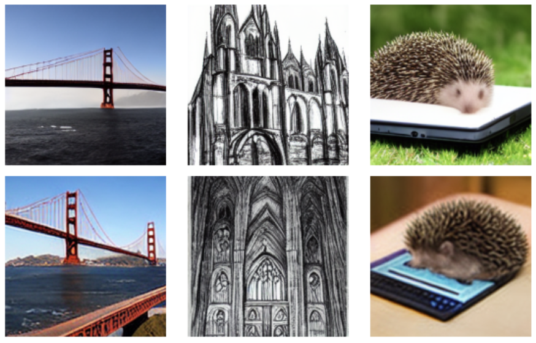

# Install (core only)
```bash

conda create -y --name demo-for-laion python=3.8.12 pip
conda activate demo-for-laion
conda install -y -c conda-forge cudatoolkit-dev==11.3.1 cudatoolkit==11.3.1 cudnn==8.2.1.32
pip install torch==1.11.0+cu113 torchvision==0.12.0+cu113 -f https://download.pytorch.org/whl/torch_stable.html
pip install https://github.com/learning-at-home/hivemind/archive/61e5e8c1f33dd2390e6d0d0221e2de6e75741a9c.zip
pip install matplotlib
```

### Call remote inference

Call the remote inference:

```python
from client import DiffusionClient

client = DiffusionClient(
    initial_peers=['/ip4/193.106.95.184/tcp/31234/p2p/Qmas1tApYHyNWXAMoJ9pxkAWBXcy4z11yquoAM3eiF1E86'],
)

images = client.draw(2 * ['a photo of san francisco golden gate bridge',
                          'a graphite sketch of a gothic cathedral',
                          'a mecha robot holding a picture of a hedgehog'])
```

Draw results (e.g., in a Jupyter notebook):

```python
import matplotlib.pyplot as plt

plt.figure(figsize=(10, 6))
for index, img in enumerate(images):
    plt.subplot(2, 3, index + 1)
    plt.imshow(img)
    plt.axis('off')
plt.tight_layout()
plt.show()
```

Expected output:



### Run server

```python
python -m run_server --identity server1.id --host_maddrs "/ip4/0.0.0.0/tcp/31234"
# if there are existing servers, add --initial_peers ADDRESS_PRINTED_BY_ONE_OR_MORE_EXISTNG_PEERS # e.g. /ip4/123.123.123.123/tcp/31234
```

## Authors

[
Based on assorted code by shuf(mryab@ younesbelkada@ borzunov@ timdettmers@ dbaranchuk@ greenfatguy@ artek0chumak@ and hivemind contributors)
]
